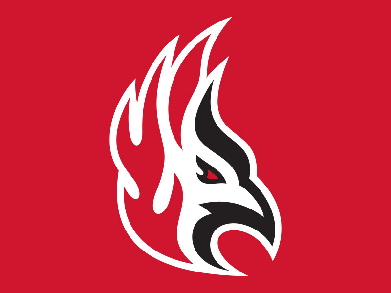

# Agile Project
This repository is provided to help you build a mini-project using the agile lifecycle model. You will store your planning documents and code in it.

## Docs
I am providing three document templates that I want your team to fill out to guide you through the project:

- Product Backlog
  - Holds the user stories for the entire product
- Sprint Backlog
  - There is an entry for each sprint. Each entry holds the tasks needed to accomplish the sprint's user stories.
- Sprint Review
  - Completed at the end of every sprint. It holds retrospective information about each sprint.

The goal is to get the team familiar with doing some planning before jumping into writing code. I have no minimum required length for these documents. They are your documents, use them to help keep you organized.

### Markdown
Markdown is a simple way to format documents. When a Markdown-ready viewer displays the contents of a file, it formats it to look like HTML. However, Markdown is significantly easier to write than HTML. VSCode supports displaying Markdown in a preview window. GitHub uses Markdown extensively including in every repo's description file, ```README.md```.

All Markdown files end with the extension ```.md```. There is a Markdown tutorial [here](https://www.markdowntutorial.com/) and a Markdown cheatsheet [here](https://www.markdownguide.org/cheat-sheet/).

#### Images
If your team would like to add images, place them in the ```docs/images/``` directory in this repo and reference them using markdown like this:

```

```

Here is how to add the Carthage logo to a Markdown file (you can see the image in the repo right now):

```

```


This ensures that images are correctly linked and displayed when viewing the documentation on GitHub or any Markdown-supported platform.

## Code
The ```code``` directory is used to store your code. You can put it all in one directory or you can create subdirectories.

I have added a ```main.cpp``` file to get you started. Feel free to use it to test each member's tool setup. Afterward, you can build on it (or not).

```cpp
#include <iostream>
using namespace std;

int main()
{
    cout<<"Agile Project"<<endl;
    return 0;
}
```

## Project Do's and Don'ts
- **DO** work together as a group. I know that some people dislike working in groups but it is a fundamental skill for a software developer. You don't need to complete all of the work while in each other's presence but you should discuss what needs to happen at each step along the way.
- **DON'T** simply assign work and disperse, it will *not* work. You need to be communicating about what each member is supposed to do and set expectations about when it will be complete.

---

- **DO** commit to putting effort into this process. 
- **DON'T** disappear from the group and expect to get any credit for the project.

---

- **DO** be a good teammate.
- **DON'T** be a jerk, no exceptions!

---

- **DO** communicate regularly with your group. Use a shared document, group chat, issue tracking on GitHub, or any other communication tool to stay organized.
- **DON'T** assume that someone else will take care of a task without confirming responsibilities.

---

- **DO** review each other's work and give constructive feedback. Code reviews and document reviews help improve quality.
- **DON'T** blindly merge changes into the repository without understanding them or discussing major modifications.

---

- **DO** use development branches and add meaningful commit messages in Git. Each commit should describe what was changed and why. Merge completed work into the main branch.
- **DON'T** push large, untested changes all at once. Commit frequently in small chunks.

---

- **DO** ask questions when you are unsure about something. Your teammates and I are here to help.
- **DON'T** wait until the last minute to raise concerns. Address issues early before they become bigger problems.

---

- **DO** stick to the agile process. Focus on user stories in the product backlog and let those drive everything else.
- **DON'T** jump straight into coding before properly planning. A well thought out design saves time in the long run.

---

- **DO** find ways to make yourself useful. Not everyone needs to write an equal amount of code or work on the same things, but you can usually help your group make progress if you communicate well. Feel free to be someone's copilot when they are working on code.
- **DON'T** fall too behind if others are waiting for you to complete a task. If you do fall behind, let the group know and maybe someone else can help you out.

---

If you have any questions feel free to ask me! I'll answer professor questions, customer questions, and give advice if asked.